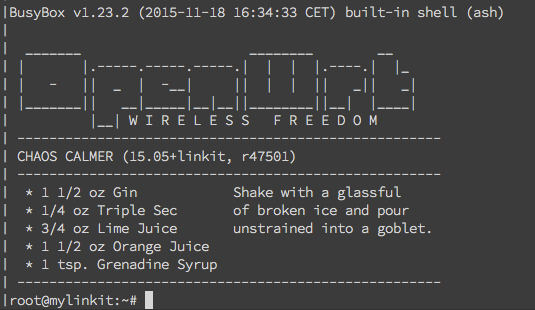

title: 'LinkIt Smart 7688 Intro. & Setup'
date: 2016-02-13 22:59:00
tags:
	- embedded system
	- LinkIt7688
categories:
	- tech
---

## 說明書
- 官方說明書在[這裡](http://labs.mediatek.com/fileMedia/download/87c801b5-d1e6-4227-9a29-b5421f2955ac)
- [wiki](http://www.seeedstudio.com/wiki/LinkIt_Smart_7688_Duo)

以下簡稱7688

## Intro.
MediaTek LinkItTM is a collection of development platforms designed for the prototyping of Wearable and Internet of Things (IoT) devices. Each development platforms provide a collection of tools, hardware and related resources to ----enable developers to address various Wearable and Internet of Things (IoT) device sectors. 

## Setup
### Prerequsites
- Micro USB cable

### Steps

1. 將usb接到7688上面用來供電
2. 一開始的時候預設是AP mode,所以必須讓你的筆電連到7688這個AP上面
3. 打開瀏覽器進入http://mylinkit.local ，然後就會看到7688的網頁版介面
4. 設定root密碼（第一次打的時候就是設定了不用確認）
5. 建議先到網路設定把它設為work station 模式，確保你的筆電跟7688是在同一個WiFi底下
	- 你會發現如果是AP模式的時候，你的電腦是無法上網的，找資料看hackpad的時候滿不方便的
6. 這時候可以利用ssh登入 `ssh root@mylinkit.local` 使用一開始設定的密碼就可以登入了！
7. 成功你會看到下圖



## Example
在`/IoT/examples`這個目錄底下有三個內建的範例程式，以`blink-gpio44.py`為例子

```python
import mraa
import time

x = mraa.Gpio(44)
x.dir(mraa.DIR_OUT)
while True:
    x.write(1)
    time.sleep(0.2)
    x.write(0)
    time.sleep(0.2)
```
- mraa 是一個以 C/C++ 所寫的 Library，用來控制各種硬體協定和介面，因為支援各種語言（如：Python、JavaScript 等），所以我們可以用語言來使用這個函式庫。
- GPIO-44是wifi燈號，所以我們執行這個程式就可以看到wifi燈號在閃爍
	- 0:亮
	- 1:暗

## Notes
- Bootloader:Started by the hardware, responsible for basic initialization, loading and executing the kernel
- Cross-compilation toolchain:Compiler that runs on the development machine, but generates code for the target
- [Binutils](http://www.gnu.org/software/binutils/)when dealing with binary

## References
- [Embedded Linux System Development](http://free-electrons.com/doc/training/embedded-linux/embedded-linux-slides.pdf)
- [Make your own firmware practice](https://www.facebook.com/kstan/posts/10206865897579881)
